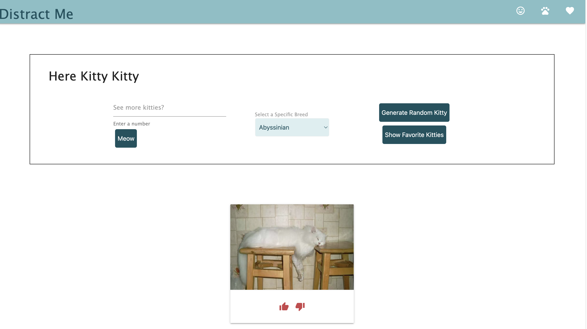
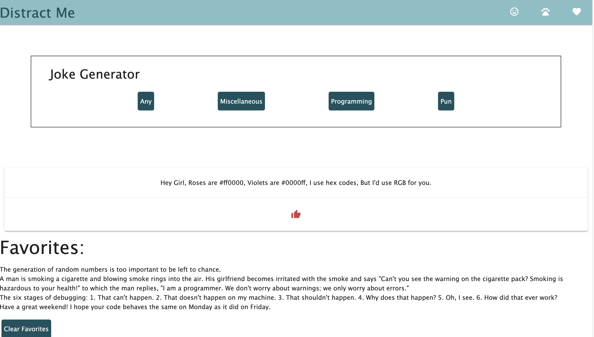
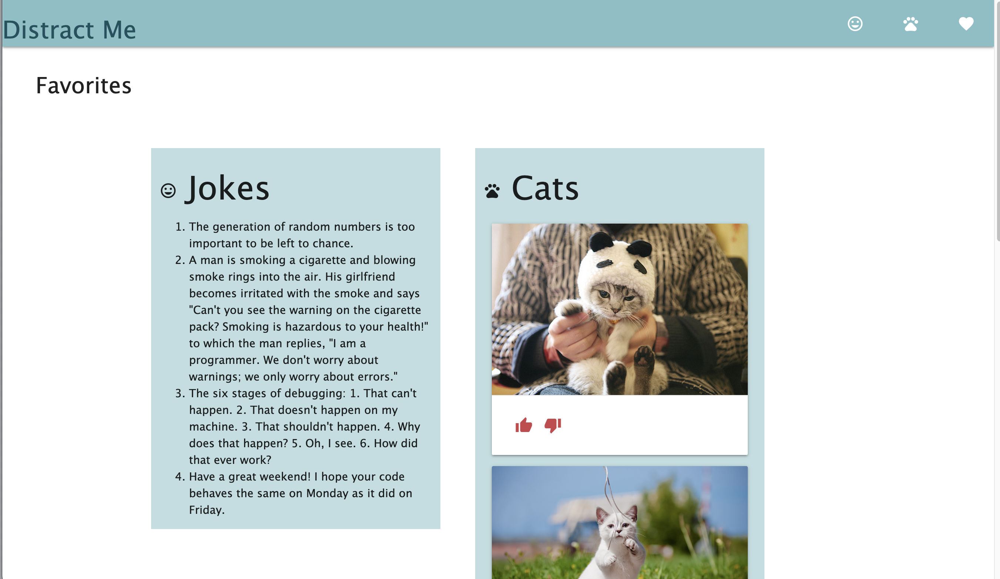

# Distract Me

Distract_me is an application where users can choose to be distracted with either cats or jokes to entertain themselves.

## Acceptance Criteria

-   It is done when the user can view jokes by Any, Random, Programming, or Pun.

-   It is done when the user can favorite their jokes and have it saved to local storage.

-   It is done when the user can select a number of cats to view, a breed of cats to view, see their favorited cats, or get a random cat photo.

-   It is done when the user can favorite their cat pictures and have it saved to local storage.

-   It is done when there are viewable favorite joke and cats from local storage.

## ReadME

In this project we were able to use our skills learned from our first 6 weeks to produce and application using html, css, and javascript frameworks. We learned to collaborate in a group setting, while all having different tasks to complete idividually.

## Notes

[Materialize Framework](https://materializecss.com/)

[Used Cat API](https://thecatapi.com/)

[Used Joke API](https://sv443.net/jokeapi/v2/)

## Links and Mockups

This is the github repo location: [distract_me](https://github.com/peterkim1025/distract_me)

This following is a link to the deployed application:[Deployed Distract Me project](https://peterkim1025.github.io/distract_me/)

